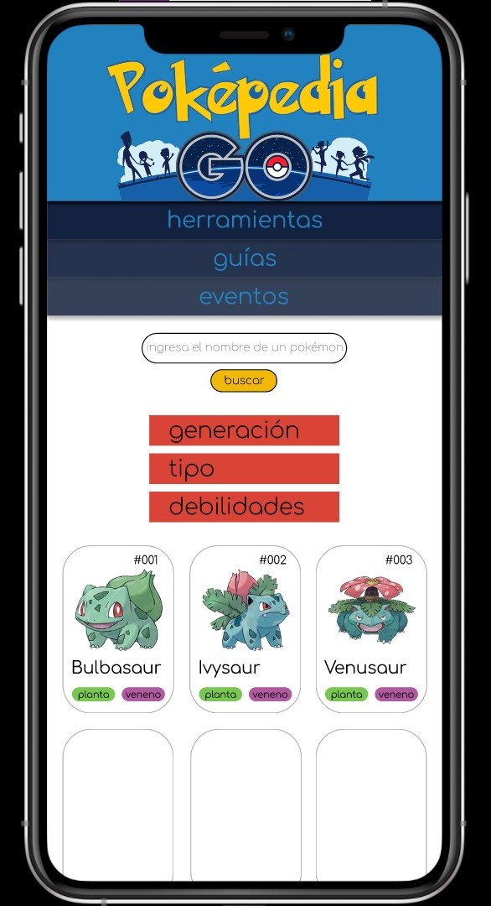
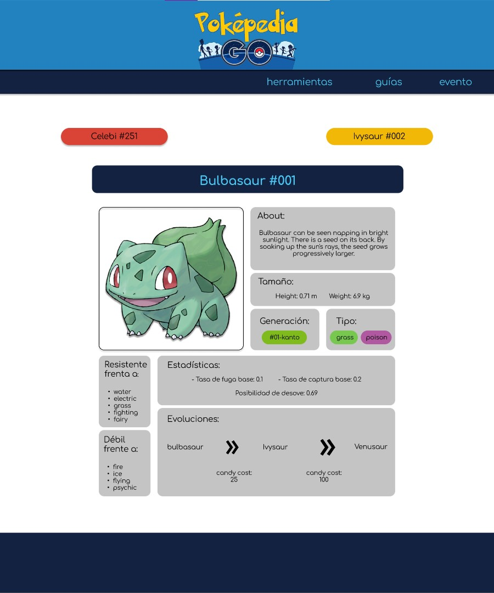
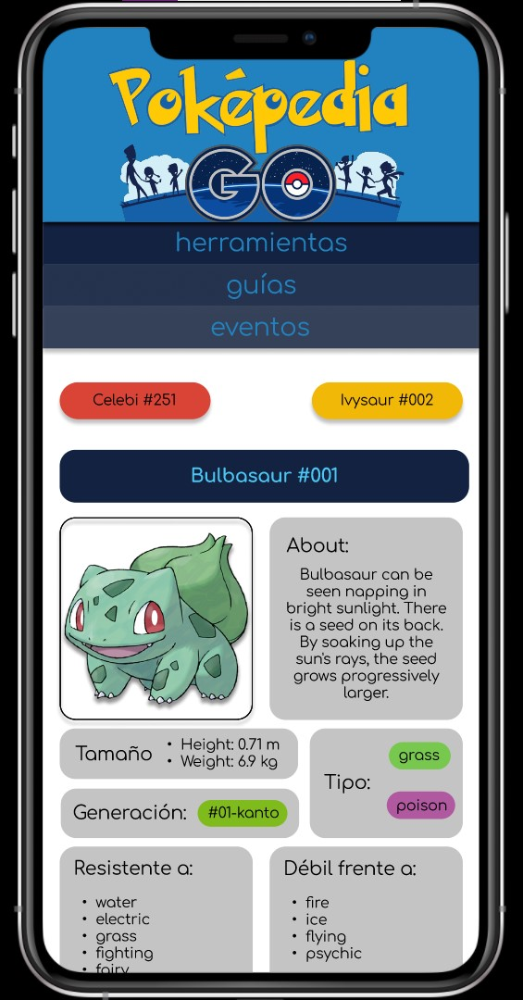
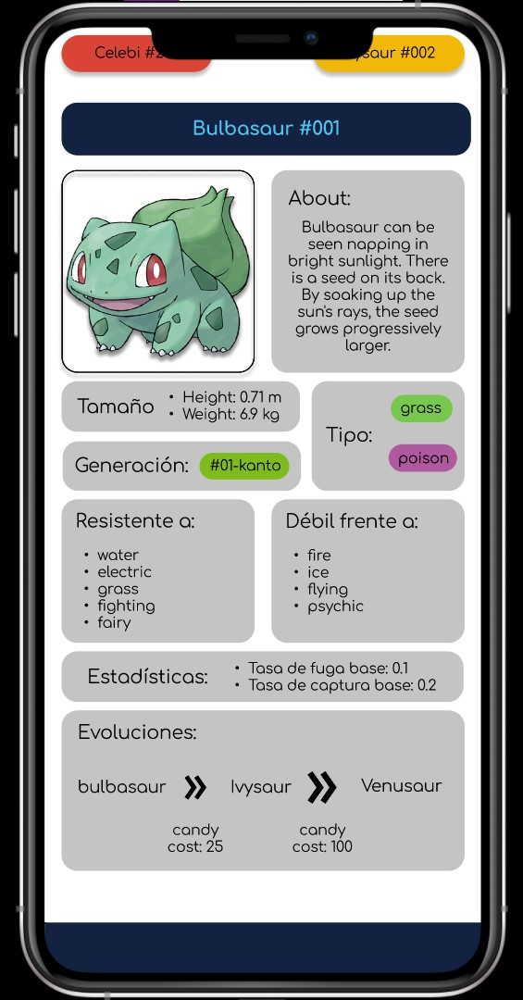
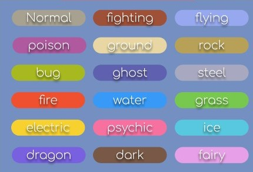

# Proyecto DataLovers "Pokepedia Go"

## Índice

* [1. Resumen del proyecto](#1-resumen-del-proyecto)
* [2. Elección del proyecto](#2-elección-del-proyecto)
* [3. El Usuario](#3-el-usuario)
* [4. Prototipado de interfaz de usuario de baja fidelidad](#4-prototipado-de-interfaz-de-usuario-de-baja-fidelidad)
* [5. Prototipado de interfaz de usuario de alta fidelidad](#5-prototipado-de-interfaz-de-usuario-de-alta-fidelidad)

***

## 1. Resumen del proyecto

POKEPEDIA GO:
Página web con formato enciclopedia sobre pokémones y principales características de estos que sean de utilidad para mejorar rendimiento de juego en la app Pokémon Go.

[Link a hacia la Demo] (<!-- aquí poner link aquí -->)

***

## 2. Elección del proyecto

Ambas integrantes del equipo de trabajo teníamos claro queríamos trabajar en el proyecto Data Lover y escogimos la temática pensando en las posibilidades que teníamos de ponernos en contacto con usuarios o consumidores de reales de las 4 opciones de info que teníamos disponibles. Debido a los anterior escogimos trabajar la temática de Pokémon Go.

***

## 3. El usuario

Para definir las necesidades de los potenciales usuarios que teníamos que suplir utilizamos en primera instancia la user research que venía incluida en el boiler plate de proyecto.
Por otra parte entrevistamos y realizamos una encuesta entre usuarios reales de la app Pokémon Go, con el objetivo de saber si existían más necesidades de info que las planteadas en la user research que teníamos disponible.

Sobre la base de lo anterior, definimos que nuestro principales potenciales usuarios serían
- Jugador habitual de app Pokémon Go busca información que le permita mejorar su rendimiento de juego.
- Jugador esporádico de la app Pokémon Go que desea obtener información que le permita jugar a un nivel más competitivo.

Así mismo, concluimos que las principales necesidades que aspirábamos a cubrir con nuestra página web serían las siguientes:
- Tener acceso a una lista completa de los pokémones y sus principales características (para efectos de la data con la que contábamos para trabajar esto corresponde solo a la 1° y 2° generación de pokemones).
- Tener acceso a un perfil de cada pokémon que incluya información más detallada y relevante para mejorar rendimiento de juego en app Pokémon Go.
- Poder filtrar los pokémones por características relevantes para mejorar rendimiento de juego en app Pokémon Go, como lo son tipo y debilidades.

Finalmente, esto se tradujo en las siguientes historias de Usuario:

### Historia de Usuario 1
Yo como: Jugador habitual o esporádico.
Quiero: Ver los 251 pokémones desplegados en pequeñas tarjetas que contengas una imagen y sus principales características como número nombre y tipo.
Para: reconocerlos fácilmente.

### Historia de Usuario 2
Yo como: Jugador esporádico de app Pokémon Go.
Quiero: que la página cuente con un buscador de pokémones por nombre.
Para: ver más datos de un pokémon en específico sin necesidad de revisar la lista completa de pokémones. 

### Historia de Usuario 3
Yo como: Jugador habitual de app Pokémon Go.
Quiero: tener acceso a un perfil completo del Pokémon seleccionado o buscado.
Para: Contar con información más detallada sobre características del pokémon seleccionado que me ayuden a mejorar mi rendimiento de juego.

### Historia de Usuario 4
Yo como: Jugador habitual de app Pokémon Go
Quiero: filtrar Pokemones por tipo.
Para: saber que pokemones existen por cada tipo.

### Historia de Usuario 5
Yo como: Jugador habitual de app Pokémon Go.
Quiero: filtrar Pokemones por debilidades.
Para: saber qué pokémones son débiles frente a un determinado tipo de pokémon.

### Historia de Usuario 6
Yo como: Jugador habitual de app Pokémon Go
Quiero: Ver evoluciones de cada Pokémon y caramelos necesarios.
Para: saber cuántos caramelos necesito para hacer evolucionar mis pokémones y orientar mis rutinas de juego sobre la base de ese objetivo.

***

## 4. Prototipado de interfaz de usuario de baja fidelidad

Realizamos prototipado y test de usabilidad solo en alta fidelidad.

***

## 5. Prototipado de interfaz de usuario de alta fidelidad

[Link hacia presentacion prototipo final en Figma]
(https://www.figma.com/proto/HoG8PBmfhaZnWs6ZCz9BaJ/Pokepedia-Go?node-id=2%3A2&scaling=min-zoom&page-id=0%3A1)

### Prototipo Historia de Usuario 1 y 2

#### Desktop (1440px width)

#### Mobile (414px width)

### Prototipo Historia de Usuario 3 y 6

#### Desktop (1440px width)

#### Mobile (414px width)

### Prototipo Historia de Usuario 4

#### Desktop (1440px width)

#### Mobile (414px width)

### Prototipo Historia de Usuario 5

#### Desktop (1440px width)

#### Mobile (414px width)

 
Cabe destacar que el desarrollo de todos estos prototipos se realizó en función del trabajo por historia de usuario, es decir, se prototipó la primera historia de usuario; se codeó la historia y, luego de comprobar el cumplimiento de los criterios de aceptación y definition of done de la misma, se procedió a prototipar la segunda historia de usuario y así sucesivamente.

***

